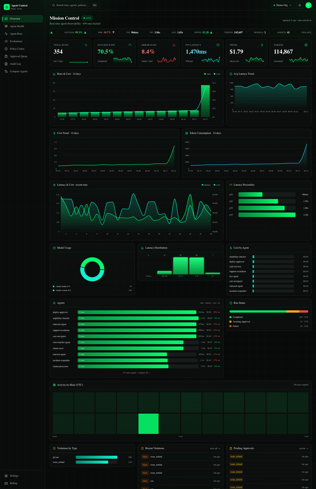
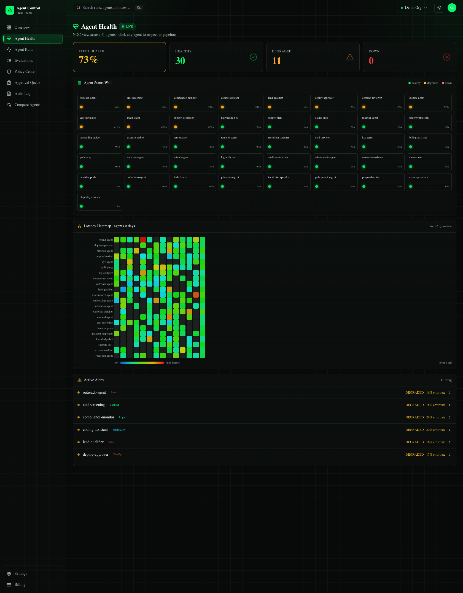
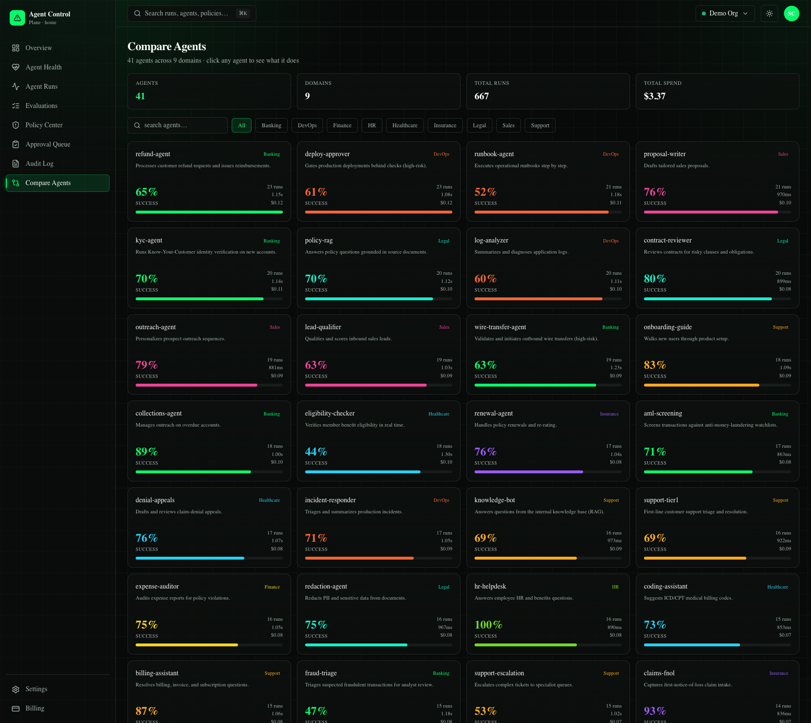
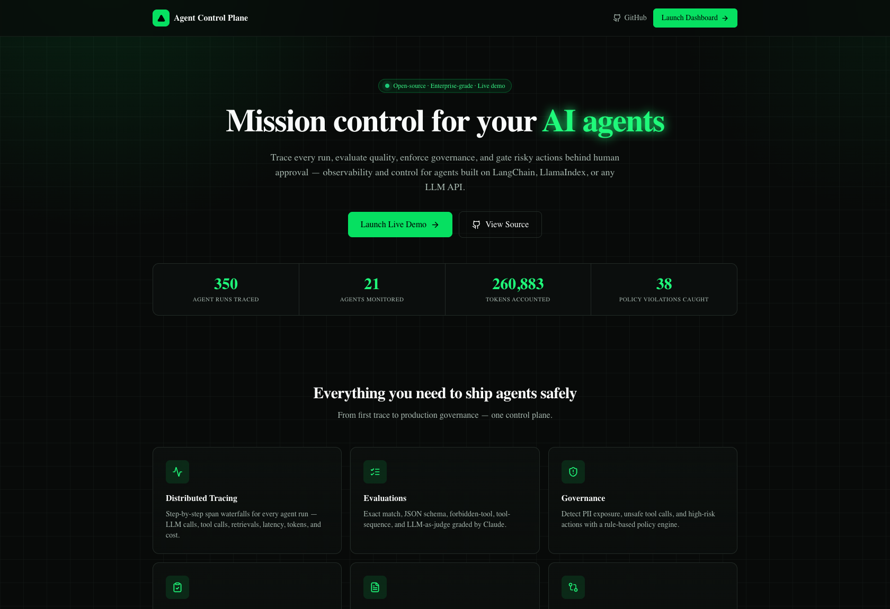

<div align="center">

# 🛰️ Agent Control Plane

### Testing, Observability & Governance for Enterprise AI Agents

**Mission control for AI agents** — trace every run, evaluate quality, enforce governance, gate risky actions behind human approval, and monitor agent fleet health in real time. For agents built with **LangChain, LlamaIndex, custom Python, or any LLM API**.

[**🔗 Live Demo**](https://agents-control-plane.venkatasaicharan.com) · [Python SDK](packages/sdk-python) · [Architecture](ARCHITECTURE.md) · [Deploy Guide](docs/DEPLOY.md)



</div>

---

## What it is

Enterprises are shipping AI agents but have no clean way to **test, observe, evaluate, control, and audit** them. Agent Control Plane is a LangSmith/Langfuse-class platform that gives platform, MLOps, and risk teams a single "mission control" for every agent in production:

- 🔭 **Distributed tracing** — step-by-step span waterfalls (LLM → tool → retrieval) with latency, tokens & cost per step
- 🧪 **Evaluations** — exact match, JSON-schema, forbidden-tool, tool-sequence, and **LLM-as-judge** (Claude)
- 🛡️ **Governance** — rule-based PII detection, unsafe-tool & high-risk-action policies
- 🙋 **Human-in-the-loop** — pause risky actions (refunds, wires, prod APIs) for approval before they run
- 📋 **Audit logs** — immutable, append-only, exportable compliance trail
- 🩺 **Fleet health (NOC)** — per-agent health, alerts, and a latency heatmap to know *when an agent breaks*

> Built end-to-end, solo: Python SDK → FastAPI ingestion → Postgres / Redis / Qdrant → Next.js dashboard → deployed on a self-managed VPS (Docker + Traefik HTTPS) with the frontend on Vercel.

---

## 📸 Screens

### Mission Control — real-time observability
Live KPIs, throughput & cost trends, latency percentiles, model usage, per-agent breakdowns, an hourly heatmap, and a streaming activity feed — refreshing every few seconds.

### Agent Health — Grafana-style NOC

Fleet-health %, a status-wall of every agent (green/amber/red), an **agents × days latency heatmap**, active alerts, and a click-through **pipeline view** that shows exactly which step failed.

### Compare Agents

40+ enterprise agents across 9 domains. Search, filter by domain, and click any agent for its purpose, deep stats, latency trend, and recent runs.

### Landing


---

## ✨ Feature highlights

| Area | What you get |
|---|---|
| **Tracing** | Trace + span model (OpenTelemetry-compatible). Tool inputs/outputs, errors, latency, token & cost accounting per span. |
| **Trace waterfall** | Interactive, expandable span timeline with per-step token/cost and FAIL markers. |
| **Evaluations** | Pluggable evaluators incl. Claude-as-judge with structured rubric scoring. |
| **Governance** | PII (SSN/card/email/phone), unsafe-tool deny-lists, high-risk-action → require-approval. |
| **Approvals** | SDK blocks on `require_approval()`; dashboard approve/reject resumes the run; every decision audited. |
| **Agent Health** | Healthy/Degraded/Down status logic, alert feed, status wall, latency heatmap, pipeline drill-down. |
| **Analytics** | Server-side aggregates: 14-day trends, percentiles, per-agent/model/status breakdowns. |
| **Multi-tenant** | `org_id` isolation on every row; API-key (SDK) + Clerk (dashboard) auth. |

---

## 🏗️ Architecture

```
 Customer Agent (LangChain / custom)
       │  acp SDK — fails open, batches spans
       ▼  HTTPS  POST /v1/traces
 ┌──────────────────────────────────────────────┐
 │ FastAPI  — ingest · runs · analytics ·        │
 │           evals · policies · approvals · audit│
 └───┬───────────────┬───────────────┬───────────┘
   Postgres        Redis           Qdrant
   metadata/audit  live + queue    trace similarity
       │               │               │
       ▼  arq workers: LLM-judge · policy checks · embeddings
       ▼  Anthropic (Claude Haiku)
 ┌──────────────────────────────────────────────┐
 │ Next.js dashboard (Vercel) — Clerk auth        │
 └──────────────────────────────────────────────┘
```

One Python codebase across SDK, API, and workers → shared models, zero serialization drift. See [ARCHITECTURE.md](ARCHITECTURE.md).

---

## 🧰 Tech stack

| Layer | Tech |
|---|---|
| **SDK** | Python (`agent-control-plane`), `httpx`, fail-open, LangChain callback |
| **Backend** | FastAPI, SQLAlchemy 2 (async), Pydantic v2, `arq` workers |
| **Data** | PostgreSQL · Redis · Qdrant (vectors) · `fastembed` |
| **AI** | Anthropic Claude (LLM-as-judge) |
| **Frontend** | Next.js 14 (App Router), TypeScript, Tailwind, Recharts |
| **Auth / Billing** | Clerk · Stripe (test) |
| **Infra** | Docker Compose · Traefik (auto-HTTPS) · Vercel · self-managed VPS |

---

## 🚀 Quickstart (zero infra — SQLite)

```bash
git clone https://github.com/saicharankarasala/Agents_Control_Plane.git
cd Agents_Control_Plane

# 1. backend (SQLite fallback — no Postgres needed)
python -m venv .venv && source .venv/bin/activate
pip install -e packages/sdk-python
pip install fastapi "uvicorn[standard]" pydantic-settings "sqlalchemy[asyncio]" aiosqlite jsonschema httpx
cd apps/api && ENV=development uvicorn app.main:app --reload --port 8000 &

# 2. send a traced agent run through the SDK
python examples/custom_agent.py

# 3. seed rich demo data (40+ agents, 14-day history)
python seeds/generate_demo_data.py --n 120
python seeds/backfill.py --endpoint http://localhost:8000 --days 14 --per-day 40

# 4. dashboard
cd apps/web && npm install && npm run dev   # http://localhost:3000
```

---

## 🐍 SDK in 6 lines

```python
import acp
acp.init(api_key="acp_...", project="support")

with acp.run(agent="refund-agent", user_input=q) as run:
    with run.span("llm", model="claude-sonnet-4-6") as s:
        s.set_output(resp); s.set_tokens(input=120, output=80)

    with run.tool("issue_refund", args={"amount": 500}) as t:
        run.require_approval(t)          # ⛔ blocks until a human approves
        t.set_tool_output(do_refund())

    run.set_output(answer)
```

LangChain: `agent.invoke(x, config={"callbacks": [ACPCallbackHandler(agent="support")]})`. The SDK **fails open** — network/API errors never break your agent.

---

## 🏭 Production (Docker + Traefik on a VPS)

```bash
cp .env.example .env          # add ANTHROPIC_API_KEY, domain, etc.
docker compose -f docker-compose.traefik.yml up -d --build
```
Plugs into an existing Traefik for automatic Let's Encrypt HTTPS. Full walkthrough in [docs/DEPLOY.md](docs/DEPLOY.md). Frontend deploys to Vercel.

---

## 📁 Project structure

```
apps/
  api/            FastAPI: routers/ services/ workers/ models, alembic
  web/            Next.js dashboard: app/ components/ lib/
packages/
  sdk-python/     the open-source acp SDK
seeds/            demo data + continuous live-traffic generator
infra/            Dockerfiles, Caddyfile, Helm/Terraform stubs
docs/             DEPLOY.md, screenshots/
```

---

## ✅ Tests

```bash
cd apps/api && pytest -q              # ingest, idempotency, governance
cd packages/sdk-python && pytest -q   # capture, decorator, pricing, fail-open
```

---

## 🗺️ Roadmap

- Real Clerk auth + per-org API keys (currently open `DEMO_MODE`)
- Full 7 evaluator types + dataset/regression management
- Alerting (Slack/webhook) when an agent goes Down
- Kafka/Redpanda ingestion · Temporal durable pipelines · Helm chart

## License

MIT (SDK). Built by [@saicharankarasala](https://github.com/saicharankarasala).
